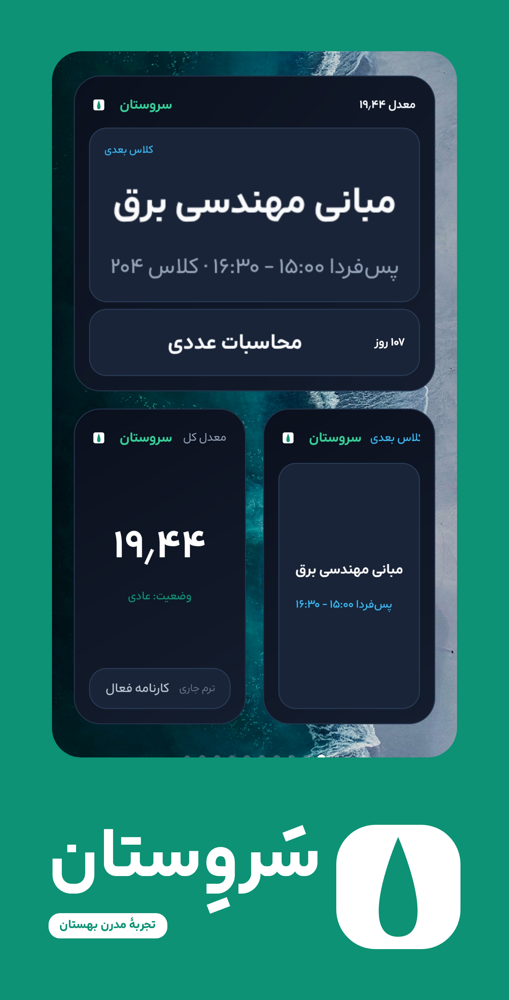
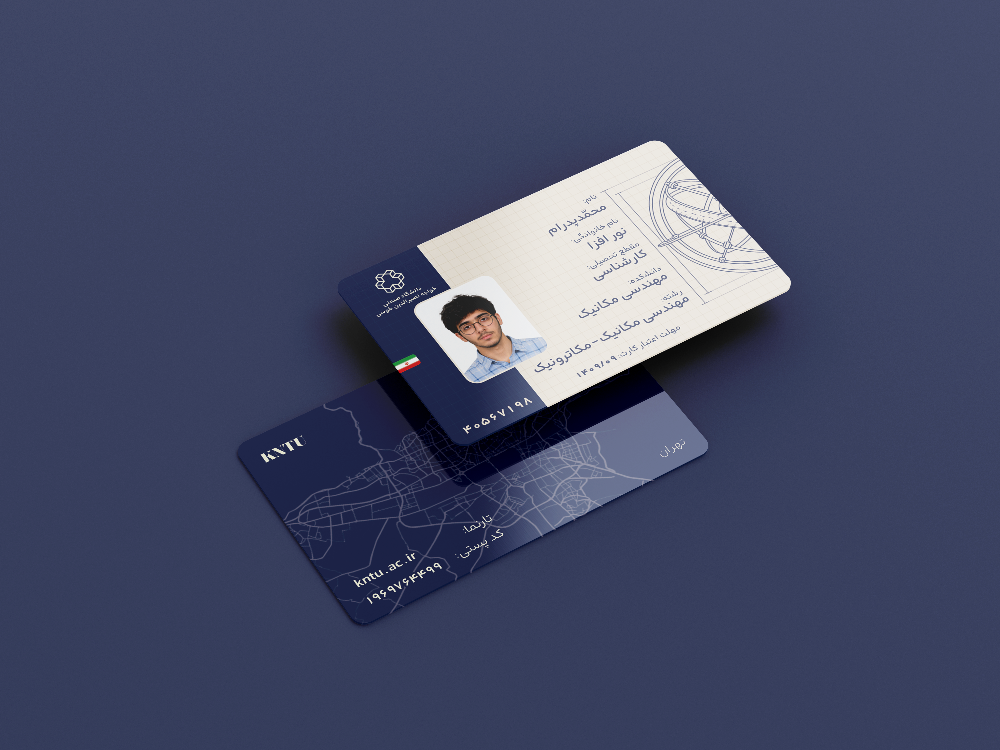
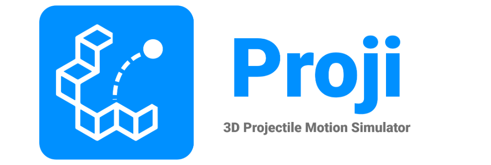
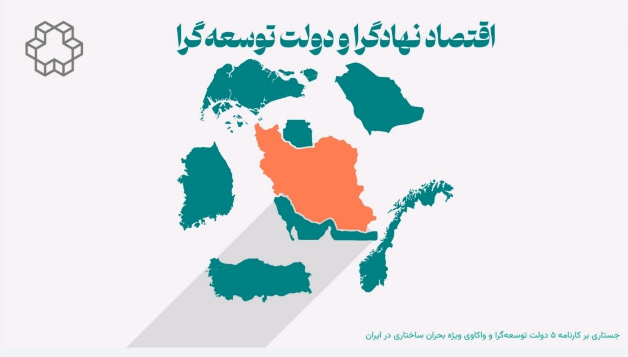

---
title: فهرست پروژه‌ها
---

# پروژه‌های دانشگاهی و پژوهشی
## مجموعه سامانه‌های هوشمند، دیزاین‌سیستم، شبیه‌سازها و مطالعات توسعه

درباره این بخش

در این بخش، پروژه‌های عملی، سامانه‌های نرم‌افزاری، کانسپت‌های طراحی هویت بصری و پژوهش‌های علمی دانشگاهی به صورت مدون و یکپارچه گردآوری شده‌اند. برای مشاهده جزئیات، مستندات و منابع هر پروژه روی کارت مربوطه کلیک کنید.

---

  <!-- کارت ویژه و برجسته ۱: اکوسیستم هوشمند سروستان -->
  

    

      
      
        
        پروژه شاخص · نسخه ۱.۱.۰
      
    

    

      

        <h3 class="project-card-title" style="color: var(--color-primary); font-size: 1.25rem;">
          <a href="sarvestan/" class="stretched-link">اکوسیستم هوشمند سروستان (Sarvestan)</a>
        </h3>
        

          سامانه دانشگاهی و دیزاین‌سیستم
          اپ اندروید + افزونه دسکتاپ
        

      

      

        سامانه مدرن، مستقل و آفلاین بهستان ۲.۰ برای دانشجویان خواجه نصیر؛ مجهز به دیزاین‌سیستم اختصاصی Sarv UI، پشتیبانی از کهاد، سایلنت خودکار سر کلاس (DND)، یادآور سماد و ۳ ویجت تعاملی هوم‌اسکرین.
      

      <a href="sarvestan/" class="project-card-footer" style="border-top-color: color-mix(in oklab, var(--color-primary) 30%, transparent);">
        مشاهده جزئیات، دانلود اپ و سورس‌کد
        
          ورود
          <svg width="16" height="16" viewBox="0 0 24 24" fill="none" stroke="currentColor" stroke-width="3"><path d="m15 18-6-6 6-6"/></svg>
        
      </a>
    

  

  <!-- کارت ۲: طراحی کارت دانشجویی دانشگاه -->
  

    

      
    

    

      

        <h3 class="project-card-title">
          <a href="kntu-card/" class="stretched-link">طراحی کارت دانشجویی هوشمند (KNTU Card)</a>
        </h3>
        طراحی هویت بصری و گرافیک
      

      

        کانسپت مدرن و مینیمال بازطراحی کارت دانشجویی دانشگاه صنعتی خواجه نصیرالدین طوسی؛ طرح بدون فریم (Frameless)، هماهنگ با استانداردهای RFID تردد و سماد همراه با ماک‌آپ‌های سه‌بعدی.
      

      <a href="kntu-card/" class="project-card-footer">
        مشاهده ماک‌آپ‌ها و فایل‌های پروژه
        
          ورود
          <svg width="15" height="15" viewBox="0 0 24 24" fill="none" stroke="currentColor" stroke-width="2.5"><path d="m15 18-6-6 6-6"/></svg>
        
      </a>
    

  

  <!-- کارت ۳: شبیه‌ساز پرتابه Proji -->
  

    

      
    

    

      

        <h3 class="project-card-title">
          <a href="proji/" class="stretched-link">شبیه‌ساز ۳ بعدی حرکت پرتابه (Proji)</a>
        </h3>
        فیزیک و شبیه‌سازی
      

      

        شبیه‌سازی تعاملی و بصری فیزیک بالستیک در فضای سه‌بعدی، مدل‌سازی اثر اصطکاک و مقاومت هوا و محاسبه ریل‌تایم اوج، برد و زمان پرواز پرتابه.
      

      <a href="proji/" class="project-card-footer">
        مشاهده معرفی و مستندات پروژه
        
          ورود
          <svg width="15" height="15" viewBox="0 0 24 24" fill="none" stroke="currentColor" stroke-width="2.5"><path d="m15 18-6-6 6-6"/></svg>
        
      </a>
    

  

  <!-- کارت ۴: پژوهش اقتصاد نهادگرا و دولت توسعه‌گرا -->
  

    

      
    

    

      

        <h3 class="project-card-title">
          <a href="economics-study/" class="stretched-link">پژوهش اقتصاد نهادگرا و دولت توسعه‌گرا</a>
        </h3>
        اقتصاد کلان
      

      

        واکاوی چرایی انسداد توسعه در ایران، ارزیابی تطبیقی ۶ کشور (کره جنوبی، سنگاپور، نروژ، عربستان، ترکیه و ایران) و طراحی مدل پلتفرمی گذار ساختاری.
      

      <a href="economics-study/" class="project-card-footer">
        مشاهده سرفصل‌ها و نقشه راه گذار
        
          ورود
          <svg width="15" height="15" viewBox="0 0 24 24" fill="none" stroke="currentColor" stroke-width="2.5"><path d="m15 18-6-6 6-6"/></svg>
        
      </a>
    

  

